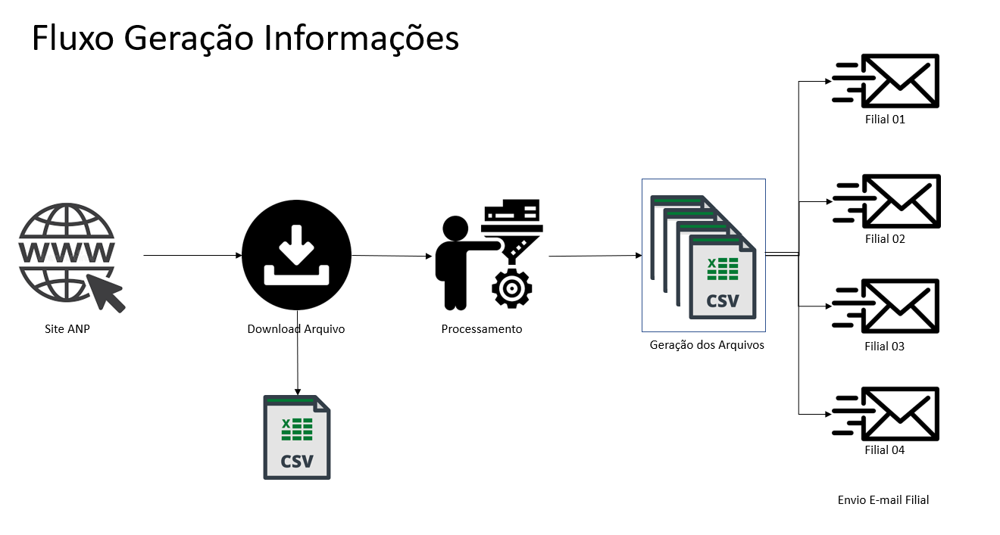

# Descrição do Projeto ANP

### <b>Descrição do Projeto:</b> Atender a uma empresa de médio porte no ramo de transportes/logística que tem atuação em 4 estados brasileiros.  

### <b>Resumo do Projeto:</b> Download de dados da ANP para o Ano Atual e Anterior (exemplo: 2022 e 2023), armazenamento dessas informações, tratamento dos dados e envio para as Unidades do Ceará, Maranhão, Rio de Janeiro e São Paulo.   

### Fluxo da Informação:

